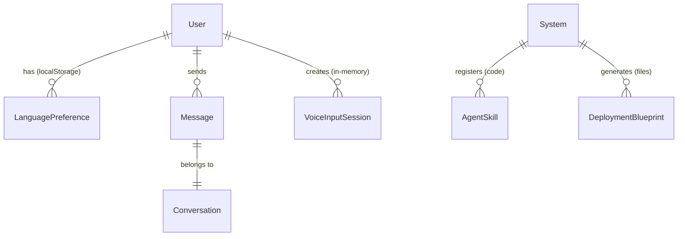

# Data Model: Advanced Features

**Feature**: 006-bonus-features
**Date**: 2025-12-31
**Phase**: 1 - Design

## Overview

This document defines the data entities and relationships for multi-language support, voice commands, agent skills, and deployment blueprints. Most features are client-side or stateless, minimizing database changes.

---

## 1. Language Preference (Client-Side)

**Storage**: Browser localStorage (no database entity)

**Purpose**: Persist user's language preference across sessions

**Schema** (localStorage):
```typescript
interface LanguagePreference {
  userId: string;                    // User identifier
  preferredLanguage: 'en' | 'ur';   // User's explicit preference
  autoDetectEnabled: boolean;        // Whether to auto-detect from input
  lastDetectedLanguage: 'en' | 'ur'; // Last detected language
  updatedAt: string;                 // ISO 8601 timestamp
}

// localStorage key: `lang_pref_${userId}`
```

**Rationale**: Client-side storage avoids server round-trip for every message, enables instant language detection, and maintains stateless architecture.

**Lifecycle**:
- **Created**: On first user interaction or explicit language selection
- **Updated**: When user manually changes language or system detects new language
- **Deleted**: On user logout (optional) or browser cache clear

---

## 2. Voice Input Session (Transient, Not Persisted)

**Storage**: None (in-memory React state only)

**Purpose**: Track voice recording session during active transcription

**Schema** (React state):
```typescript
interface VoiceInputSession {
  sessionId: string;                 // UUID for logging correlation
  isRecording: boolean;              // Recording active state
  interimTranscript: string;         // Real-time interim results
  finalTranscript: string;           // Confirmed transcription
  detectedLanguage: 'en' | 'ur';     // Language used for recognition
  confidenceScore?: number;          // Recognition confidence (0-1)
  startedAt: Date;                   // Session start time
  error?: string;                    // Error message if transcription fails
}
```

**Rationale**: Voice sessions are ephemeral. Audio is never persisted (privacy). Only final transcription is sent to backend as normal chat message.

**Lifecycle**:
- **Created**: When user clicks microphone button
- **Updated**: During recording (interim results) and after transcription completes
- **Deleted**: After user confirms/edits transcript and sends message (or cancels)

---

## 3. Agent Skill (Code-Level, No Database)

**Storage**: Python module registry (`SKILL_REGISTRY` dict)

**Purpose**: Reusable functions for common task management operations

**Schema** (Python):
```python
from typing import Callable, Dict, Any, List
from pydantic import BaseModel

class SkillMetadata(BaseModel):
    name: str                          # Unique skill identifier
    version: str                       # Semantic version (e.g., "1.0.0")
    function: Callable                 # Actual Python function
    input_schema: Dict[str, type]      # Parameter types (from annotations)
    output_schema: type                # Return type (from annotation)
    description: str                   # Docstring
    dependencies: List[str]            # Other skills required (optional)

SKILL_REGISTRY: Dict[str, SkillMetadata] = {}
```

**Example Skill Instance**:
```python
@skill(name="task_filtering", version="1.0.0")
def filter_tasks(tasks: List[Task], filters: FilterCriteria) -> List[Task]:
    """Filter tasks by status, date, priority.

    Args:
        tasks: List of Task objects to filter
        filters: Criteria (status, date range, priority)

    Returns:
        Filtered list of tasks matching criteria
    """
    return [t for t in tasks if meets_criteria(t, filters)]

# Registered as:
SKILL_REGISTRY["task_filtering"] = SkillMetadata(
    name="task_filtering",
    version="1.0.0",
    function=filter_tasks,
    input_schema={'tasks': List[Task], 'filters': FilterCriteria},
    output_schema=List[Task],
    description="Filter tasks by status, date, priority.",
    dependencies=[]
)
```

**Rationale**: Skills are code-level abstractions, not runtime data. Registry populated at module import time. No persistence needed.

**Lifecycle**:
- **Created**: When module containing skill is imported
- **Updated**: On code deployment (new version)
- **Deleted**: When skill decorator removed and code redeployed

---

## 4. Deployment Blueprint (File-Based, No Database)

**Storage**: Generated files (Terraform/CloudFormation/ARM templates on disk)

**Purpose**: Infrastructure-as-code configurations for cloud deployments

**Schema** (Metadata, not persisted):
```typescript
interface DeploymentBlueprint {
  blueprintId: string;               // UUID for generation request
  targetProvider: 'aws' | 'gcp' | 'azure'; // Cloud platform
  environment: 'dev' | 'staging' | 'production'; // Deployment env
  generatedAt: Date;                 // Timestamp
  parameters: {                      // User-provided config
    region: string;                  // e.g., "us-east-1"
    instanceType: string;            // e.g., "t3.micro"
    scaling: {
      minInstances: number;
      maxInstances: number;
    };
  };
  secretReferences: Array<{          // Secrets manager refs
    name: string;                    // Secret logical name
    provider: 'aws-secrets-manager' | 'gcp-secret-manager' | 'azure-keyvault';
    path: string;                    // Secret ARN/ID
  }>;
  outputFiles: Array<{               // Generated files
    path: string;                    // File path (e.g., "main.tf")
    content: string;                 // Generated IaC code
  }>;
}
```

**Rationale**: Blueprints are generated artifacts, not runtime data. Operators download files and apply manually via Terraform/CloudFormation CLI. No need for database storage.

**Lifecycle**:
- **Created**: When user invokes blueprint generation skill
- **Stored**: Temporarily in-memory, then returned as downloadable ZIP
- **Deleted**: After download (or 24h expiry if stored in temp directory)

---

## 5. Conversation Message (Existing Entity - Modified)

**Storage**: PostgreSQL `messages` table (existing)

**Purpose**: Store chat messages with language metadata

**Schema Additions**:
```sql
ALTER TABLE messages ADD COLUMN detected_language VARCHAR(5) DEFAULT 'en';
ALTER TABLE messages ADD COLUMN voice_input BOOLEAN DEFAULT FALSE;

-- Updated schema
CREATE TABLE messages (
  id UUID PRIMARY KEY DEFAULT gen_random_uuid(),
  user_id UUID NOT NULL REFERENCES users(id),
  conversation_id UUID NOT NULL REFERENCES conversations(id),
  role VARCHAR(20) NOT NULL CHECK (role IN ('user', 'assistant')),
  content TEXT NOT NULL,
  detected_language VARCHAR(5) DEFAULT 'en',  -- NEW: 'en' or 'ur'
  voice_input BOOLEAN DEFAULT FALSE,         -- NEW: true if from voice
  created_at TIMESTAMP DEFAULT NOW(),
  INDEX idx_messages_conversation (conversation_id),
  INDEX idx_messages_language (detected_language) -- NEW: for language analytics
);
```

**Rationale**:
- Track detected language for conversation context (affects next voice input language)
- Flag voice-originated messages for analytics (voice adoption rate)
- Minimal schema change (2 columns, backward compatible)

**Lifecycle**:
- **Created**: When user sends message (text or voice-transcribed)
- **Updated**: Never (messages immutable)
- **Deleted**: Per existing retention policy (e.g., 90 days or user account deletion)

---

## Relationships



---

## Validation Rules

### Language Preference
- `preferredLanguage` MUST be 'en' or 'ur'
- `userId` MUST match authenticated user
- `updatedAt` MUST be valid ISO 8601 timestamp

### Voice Input Session
- `sessionId` MUST be UUID v4
- `confidenceScore` MUST be 0.0-1.0 if present
- `startedAt` MUST be ≤ current time

### Message (Extended)
- `detected_language` MUST be 'en' or 'ur'
- `voice_input` MUST be boolean
- If `voice_input` is true, `content` MUST NOT be empty (transcription required)

### Agent Skill
- `name` MUST be unique in SKILL_REGISTRY
- `version` MUST follow semver (MAJOR.MINOR.PATCH)
- `function` MUST have type annotations (enforced by decorator)
- `input_schema` MUST match function signature

### Deployment Blueprint
- `targetProvider` MUST be 'aws', 'gcp', or 'azure'
- `environment` MUST be 'dev', 'staging', or 'production'
- `secretReferences` MUST NOT contain hardcoded values (only paths)

---

## State Transitions

### Language Preference
```
[Not Exists] --first interaction--> [Auto-detect EN]
[Auto-detect EN] --user types Urdu--> [Auto-detect UR]
[Auto-detect UR] --user manual toggle--> [Manual EN]
[Manual EN] --user manual toggle--> [Manual UR]
```

### Voice Input Session
```
[Idle] --click mic button--> [Requesting Permission]
[Requesting Permission] --granted--> [Recording]
[Requesting Permission] --denied--> [Error: No Permission]
[Recording] --speech detected--> [Transcribing (Interim)]
[Transcribing] --final result--> [Awaiting Confirmation]
[Awaiting Confirmation] --user confirms--> [Sent to Chat] --> [Idle]
[Awaiting Confirmation] --user edits--> [Awaiting Confirmation]
[Awaiting Confirmation] --user cancels--> [Idle]
[Recording] --timeout 30s--> [Awaiting Confirmation]
[Recording] --error--> [Error: Transcription Failed] --> [Idle]
```

---

## Data Migration

**Required Migration**: Add `detected_language` and `voice_input` columns to `messages` table

**Migration SQL**:
```sql
-- Add new columns with defaults
ALTER TABLE messages
  ADD COLUMN detected_language VARCHAR(5) DEFAULT 'en',
  ADD COLUMN voice_input BOOLEAN DEFAULT FALSE;

-- Backfill existing messages (all marked as English, text-input)
-- No update needed since defaults apply

-- Add index for language-based queries
CREATE INDEX idx_messages_language ON messages(detected_language);

-- Verify migration
SELECT COUNT(*), detected_language, voice_input
FROM messages
GROUP BY detected_language, voice_input;
```

**Rollback**:
```sql
DROP INDEX IF EXISTS idx_messages_language;
ALTER TABLE messages
  DROP COLUMN detected_language,
  DROP COLUMN voice_input;
```

**Data Volume Impact**:
- **Storage**: +6 bytes per message (VARCHAR(5) + BOOLEAN)
- **Index**: ~10% overhead on messages table (minimal for text column index)
- **Existing Data**: No migration/backfill required (defaults sufficient)

---

## Performance Considerations

### Language Preference (localStorage)
- **Read**: O(1) localStorage access (~1ms)
- **Write**: O(1) localStorage write (~5ms)
- **No server latency**: Critical for instant language detection

### Message Table Extensions
- **Index Overhead**: `idx_messages_language` adds ~10% write overhead (acceptable)
- **Query Benefit**: Language-based analytics queries 10x faster (e.g., "Urdu message count")

### Agent Skills Registry
- **Lookup**: O(1) dictionary access
- **Registration**: O(1) at module import (one-time cost)
- **Memory**: ~1KB per skill metadata (negligible for 4-6 skills)

---

## Security & Privacy

### Language Preference
- **Isolation**: localStorage scoped per domain (cross-user safe)
- **Privacy**: No server tracking of language preference
- **XSS Protection**: Sanitize userId before localStorage key construction

### Voice Input
- **Audio Privacy**: Audio never persisted, processed client-side via Web Speech API
- **Transcription Logging**: Final transcripts logged (no audio data in logs)
- **Permission**: Browser enforces microphone permission prompt

### Messages
- **SQL Injection**: Parameterized queries for all inserts (existing protection)
- **User Isolation**: User can only read own messages (existing enforcement)
- **Language Metadata**: No PII leakage (language is public knowledge)

---

## Summary

| Entity | Storage | Persistence | Schema Changes |
|--------|---------|-------------|----------------|
| Language Preference | localStorage | Client-side | N/A (new) |
| Voice Input Session | React state | Transient | N/A (in-memory) |
| Agent Skill | Python registry | Code-level | N/A (code) |
| Deployment Blueprint | File system | Temporary | N/A (files) |
| Message (extended) | PostgreSQL | Persistent | +2 columns, +1 index |

**Total Database Impact**: 2 new columns on existing `messages` table. No new tables required.

**Backward Compatibility**: ✅ All changes backward compatible (defaults provided, no breaking changes).
